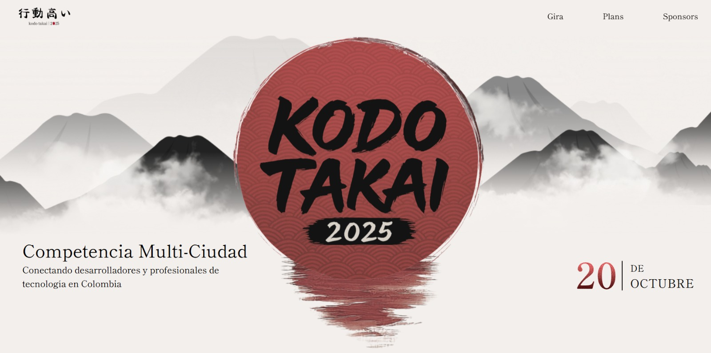

<div align="center">

# 🏔️ Kodo Takai 2025


**Una competencia multi-ciudad que conecta desarrolladores y profesionales de tecnología en Colombia**

[](https://reactjs.org/)
[](https://www.typescriptlang.org/)
[](https://vitejs.dev/)
[](https://tailwindcss.com/)

</div>

---

## 🎯 Sobre el Proyecto

**Kodo Takai 2025** es una página web moderna y elegante diseñada para promover una competencia tecnológica multi-ciudad en Colombia. La página combina elementos de diseño japonés tradicional con una estética contemporánea, creando una experiencia visual única que refleja la filosofía del evento.

### ✨ Características Principales

- **🎨 Diseño Minimalista**: Estética japonesa inspirada con montañas en capas y tipografía elegante
- **📱 Totalmente Responsivo**: Optimizado para todos los dispositivos
- **⚡ Rendimiento Optimizado**: Construido con Vite y React 19
- **🎭 Animaciones Suaves**: Transiciones fluidas y efectos visuales modernos
- **🌊 Efectos Visuales**: Fondos de montañas en capas con efectos de profundidad

## 🛠️ Stack Tecnológico

| Tecnología | Versión | Propósito |
|------------|---------|-----------|
| **React** | 19.1.1 | Framework principal |
| **TypeScript** | 5.8.3 | Tipado estático |
| **Vite** | 7.1.2 | Build tool y dev server |
| **Tailwind CSS** | 4.1.12 | Framework de estilos |
| **ESLint** | 9.33.0 | Linting y calidad de código |

## 🎨 Paleta de Colores

La página utiliza una paleta de colores cuidadosamente seleccionada que evoca la serenidad y elegancia del diseño japonés:

- **🔴 Rojo Principal**: `#DC2626` - Para acentos y elementos destacados
- **⚫ Negro**: `#000000` - Para texto y elementos de contraste
- **⚪ Beige Claro**: `#F3EFEC` - Color de fondo principal
- **🌫️ Grises**: Varios tonos para las montañas y efectos de profundidad

## 📱 Secciones de la Página

### 🏠 **Hero Section**
- Logo principal con efecto de reflexión
- Fondo de montañas en capas con efecto de profundidad
- Información del evento y fecha destacada
- Diseño completamente responsivo

### 🧭 **Navegación**
- Barra de navegación sticky con efecto blur
- Navegación suave entre secciones
- Logo interactivo que lleva al inicio

### 🗓️ **Countdown**
- Contador regresivo hasta el evento
- Diseño elegante con tipografía personalizada
- Animaciones suaves

### 🏆 **Planes y Sponsors**
- Secciones para mostrar planes del evento
- Área dedicada para patrocinadores
- Diseño modular y escalable

## 🚀 Instalación y Desarrollo

```bash
# Clonar el repositorio
git clone [tu-repo-url]
cd kt-project

# Instalar dependencias
npm install

# Ejecutar en modo desarrollo
npm run dev

# Construir para producción
npm run build

# Preview de la build
npm run preview
```

## 📁 Estructura del Proyecto

```
kt-project/
├── public/
│   └── assets/           # Recursos estáticos (SVGs, fuentes)
├── src/
│   ├── components/       # Componentes React
│   │   ├── Hero.tsx      # Sección principal
│   │   ├── Navbar.tsx    # Navegación
│   │   ├── CountDown.tsx # Contador regresivo
│   │   └── ...
│   ├── utils/           # Utilidades y assets
│   └── App.tsx          # Componente principal
└── README.md
```

## 🎯 Próximas Características

- [ ] Sistema de registro de participantes
- [ ] Integración con APIs de eventos
- [ ] Sección de noticias y actualizaciones
- [ ] Galería de eventos anteriores
- [ ] Sistema de contacto avanzado

## 🤝 Contribuir

Este proyecto está en desarrollo activo. Las contribuciones son bienvenidas:

1. Fork el proyecto
2. Crea una rama para tu feature (`git checkout -b feature/AmazingFeature`)
3. Commit tus cambios (`git commit -m 'Add some AmazingFeature'`)
4. Push a la rama (`git push origin feature/AmazingFeature`)
5. Abre un Pull Request

## 📄 Licencia

Este proyecto está bajo la Licencia MIT. Ver `LICENSE` para más detalles.

---

<div align="center">

**Desarrollado con ❤️ para la comunidad tecnológica colombiana**



</div>